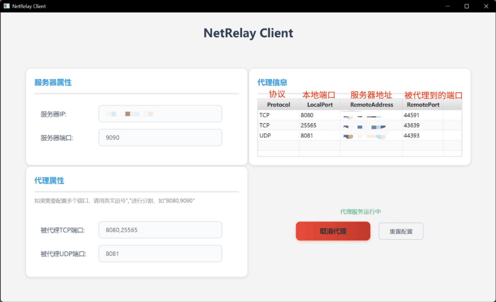

# NetRelay

服务端仓库地址:
```
https://github.com/FateIronist/NetRelay-Server
```
### 简介
    NetRelay是一个基于Java的TCP/UDP反向代理服务，用于实现内网穿透。
    这里为了保证稳定性，使用传输层中转的方法实现内网穿透。

### 更新概况
详见服务端仓库

### 使用
客户端需搭配服务端使用，且不建议本地运行服务端代理本地的客户端，由于设计问题，这样会存在端口冲突。


这里提供两种客户端使用方式：
- windows桌面应用程序：具体文件在./desktopApp/app下的zip压缩包中，下载后直接解压，然后点击 NetRelay.exe 运行即可；如需要，可以对着这个文件右键--显示更多选项--新建--快捷方式，然后把快捷方式拖到桌面就可以了。

    

- stater依赖：若是你需要代理你的Java应用程序并且由Maven管理，直接引入下述依赖，然后补充配置文件即可。
    ```
    <dependency>
        <groupId>top.fateironist</groupId>
        <artifactId>net-relay-client</artifactId>
        <version>0.0.1</version>
    </dependency>
    ```
### 配置文件
windows桌面应用程序 可以直接忽略这条
```
net-relay:
  # 服务器端
  server:
    host: 111.111.111.111
    port: 9090
  # 被代理端    
  agent:
  # 需要被代理的端口
    proxied:
      tcp: 8080,25565
      udp: 8081
```

### 废话
翔见服务端仓库

### MC Java 版联机实测
两台主机位于安徽最北部，云服务器位于上海，延迟稳定在120~130ms；   
对比樱花，选择浙江节点(物理距离与上海相近)，稳定后延迟在110ms左右；   
综合考虑樱花服务器压力、优化水平、技术层级、方案选型，在个人使用的情况下差距不大；  
当然，除了技术原因，延迟主要来源还是穿透节点的物理距离，服务器在压力正常的情况下带来的延迟极小。
